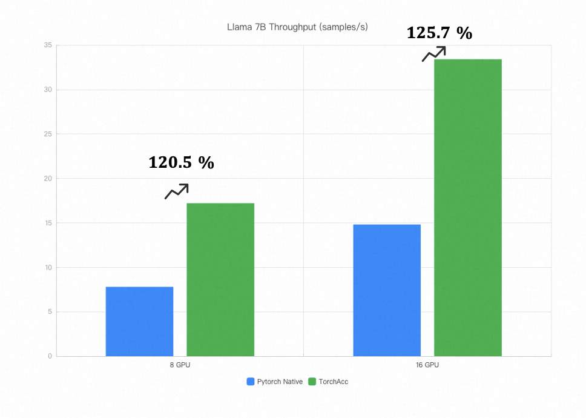
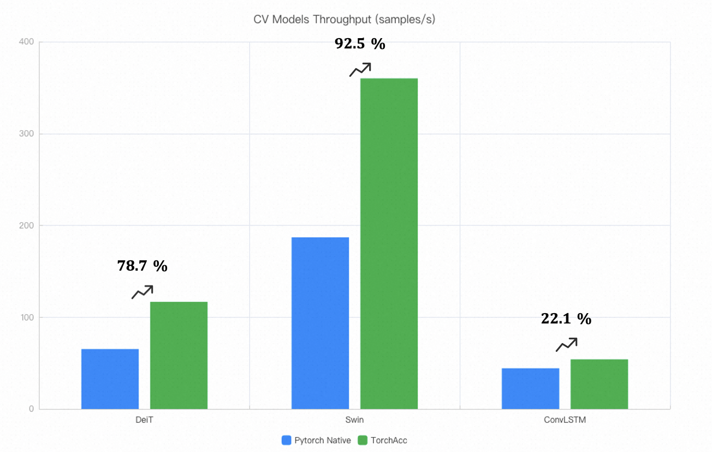
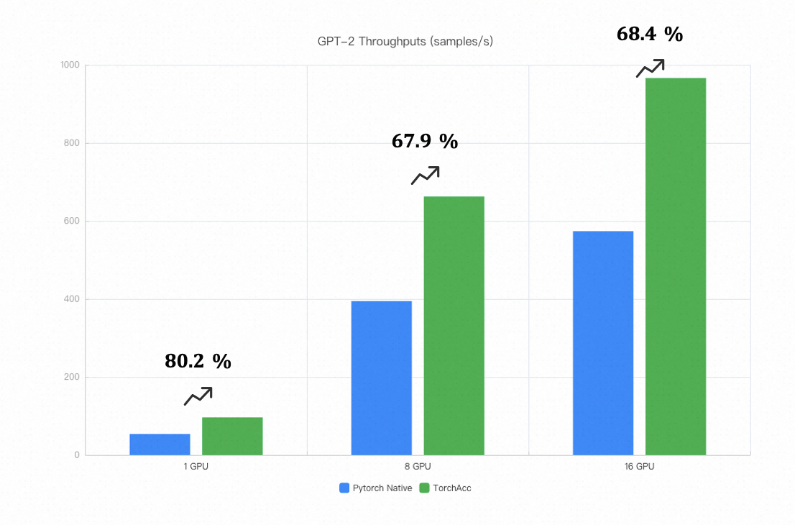

# Introduction

TorchAcc is a PyTorch distributed training acceleration framework provided by Alibaba Cloud's PAI platform.

TorchAcc leverages the work of the [PyTorch/XLA](https://github.com/pytorch/xla) to provide users with training acceleration capabilities. At the same time, we have conducted a considerable amount of targeted optimization based on GPU. TorchAcc offers better usability, superior performance, and richer functionality.

## Main Features

The key features of TorchAcc:

* Rich distributed Parallelism
    * Data Parallelism
    * Fully Sharded Data Parallelism
    * Tensor Parallelism
    * Pipeline Parallelism
    * [Ulysess](https://arxiv.org/abs/2309.14509)
    * [Ring Attention](https://arxiv.org/abs/2310.01889)
    * Flash Sequence (Solution for Long Sequence)
* Low Memory Cost
* High Performance
* Ease use

## Model Performance

Below is a summary of the performance improvements for some common algorithms after integrating with TorchAcc.

Note:
* Swin, DeiT, and ConvLSTM were tested in an environment with 8x 80G A100 GPUs per machine, with inter-machine bandwidth of 800Gb (the performance data shown is for a single card). Scalability across multiple machines is nearly linear.
* GPT-2 was tested in an environment with 8 x 16G V100 GPUs per machine, with inter-machine bandwidth of 30Gb.
* LLAMA-7B was tested in an environment with 2 machines, each with 8 x 80G A100 GPUs, and inter-machine bandwidth of 800Gb.
